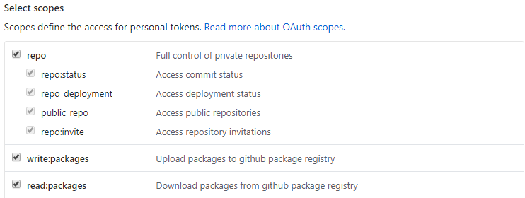

## Developing Locally

TODO

## Deploying

* Create a Personal Access Token (PAT) on GitHub.com with the following scopes:

In a terminal, run:

* `dotnet restore`
* `dotnet publish -c Release`
* `nuget pack .nuspec -Properties Configuration=Release -Version x.y.z`
* `nuget sources Add -Name "JBKLabs GitHub" -Source "https://nuget.pkg.github.com/JBKLabs/index.json" -UserName github -Password <your PAT>`
* `nuget push JBKnowledge.Extensions.RuntimeConfigurationInjection.x.y.z.nupkg -Source "JBKLabs GitHub"`

In addition, tag the current commit on GitHub. In a terminal:

* `git tag x.y.z`
* `git push origin x.y.z`

**NOTE**: Please use proper semver.
