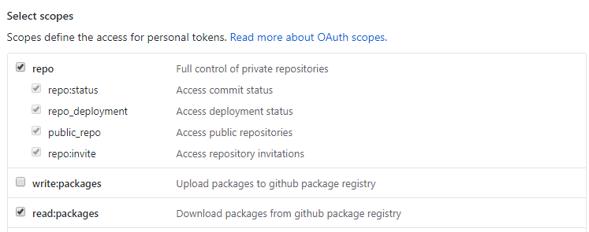
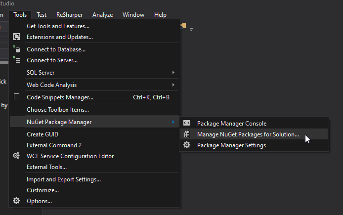
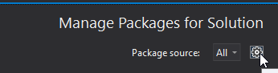
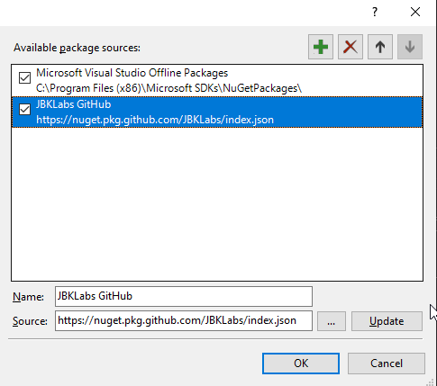
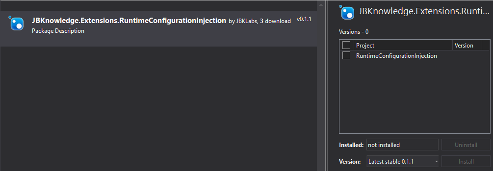

# Runtime Configuration Extension

## Installing

* Create a Personal Access Token (PAT) on GitHub.com with the following scopes:



* Manage NuGet packages for your project



* Add a new package source





* Browse for NuGet packages beginning with `JBKnowledge`. At some point, Visual studio will ask you to authenticate. Use any username, such as `github`, and use the PAT you generated previously as your password.

* At this point, you should be able to find and install `JBKnowledge.Extensions.RuntimeConfigurationInjection`




## Getting Started

This project provides an extension on `IConfiguration`. Configuration values within `appsettings` can be pulled from anywhere `IConfiguration` is injected via `(IConfiguration)configuration.GetConfig<T>("Nested:Groups:Value")`.

For example, `Email:Enabled` in the `appsettings.json` file below:

```json
{
  "Email": {
    "Enabled": true,
  }
}
```

Can be accessed like so:

```c#
public Service(IConfiguration configuration) {
  _emailEnabled = configuration.GetConfig<bool>("Email:Enabled");
}
```

In addition to being able to read from `appsettings`, you can also override any `appsettings` value using an environment variable with the following convention:

- `Email:Enabled` ---> `EMAIL_ENABLED`

If the environment variable exists on your runtime environment, it will **always be used, even if you defined a value for it within your `appsettings` file**

**NOTE**: When dealing with sensitive configuration, such as passwords and secret keys, we **strongly** recommend excluding the value from your `appsettings.json` file entirely and instead fail if an environment variable is not set. For `appsettings.local.json` files, iff they are ignored in your `.gitignore` file, is the one exception.


## Contributors

This project was built and is maintained by JBKLabs, [JBKnowledge Inc's](https://jbknowledge.com/) research and development team.

## Licensing

This package is licensed under Apache License, Version 2.0. See [LICENSE](./LICENSE) for the full license text.